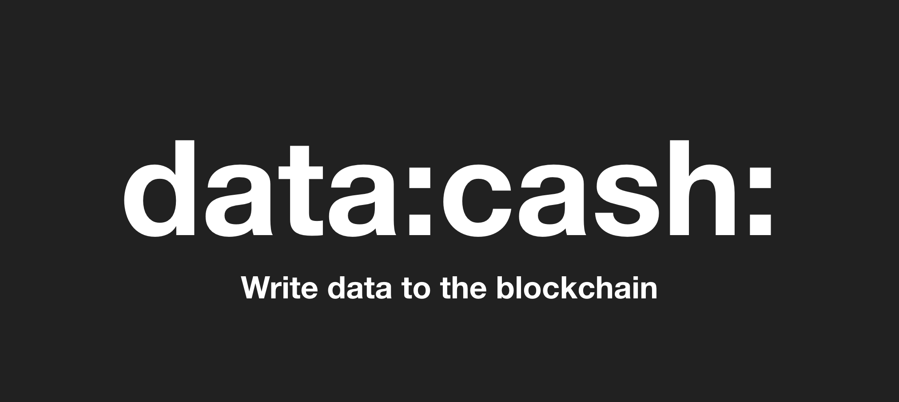
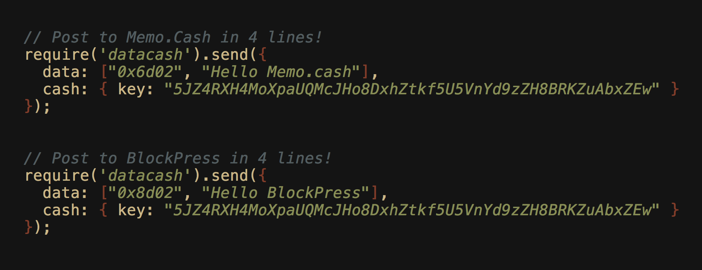

# Datacash



Datacash is the simplest library for building and broadcasting Bitcoin Cash OP_RETURN transactions.

---

# Preview

Post to the blockchain with just 4 lines of code. 



---

# Demo

[Datacash transaction composer](https://unwriter.github.io/datacash/example/index.html)

[View source](example/index.html)


# Install

## 1. In node.js

```
npm install datacash
```

and then require it

```
const datacash = require('datacash')
```

## 2. In browser

```
<script src='https://unpkg.com/datacash'></script>
```

---

# Quickstart

Send `"Hello from datacash"` to [memo.cash](https://memo.cash) in 5 lines of code.


```
const privateKey = [YOUR PRIVATE KEY HERE];
datacash.send({
  data: ["0x6d02", "Hello from datacash"],
  cash: { key: privateKey }
});
```

Above code builds an `OP_RETURN` transaction with `0x6d02 hello` as push data, and broadcasts it to Bitcoin Cash network.

---

# Powered by simple DSL

Datacash is DSL (Domain Specific Language) based. Here's an example:

```
var DSL = {
  data: ["0x6d02", "hello from datacash"],
  cash: {
    key: "5JZ4RXH4MoXpaUQMcJHo8DxhZtkf5U5VnYd9zZH8BRKZuAbxZEw",
    rpc: "https://cashexplorer.bitcoin.com",
    fee: 300,
    to: [{
      address: "1A2JN4JAUoKCQ5kA4pHhu4qCqma8jZSU81",
      value: 1000
    }]
  }
}
```

Above DSL describes a transaction that:

- Posts `"hello from datacash"` to [memo.cash](https://memo.cash) network (See the protocol at [https://memo.cash/protocol](https://memo.cash/protocol)),
- signed with a private key: `5JZ4RXH4MoXpaUQMcJHo8DxhZtkf5U5VnYd9zZH8BRKZuAbxZEw`,
- through a public JSON-RPC endpoing at [https://cashexplorer.bitcoin.com](https://cashexplorer.bitcoin.com)
- while tipping the user `1A2JN4JAUoKCQ5kA4pHhu4qCqma8jZSU81` a value of `1000` satoshis.

All you need to do to invoke it is call:

```
datacash.send(DSL)
```

If you want to build a transaction but save it for later or export it, you can instead call:

```
datacash.build(DSL, function(error, tx) {
  console.log("Here's the transaction! : ", tx)
})
```

And that's it! No complex APIs, but you can construct pretty much all kinds of OP_RETURN transactions.

---

# How it works

`datacash` is powered by [bitcoincash.js](https://github.com/bitcoincashjs/bitcoincashjs), which in turn is a fork of [bitcore-lib](https://github.com/bitpay/bitcore-lib), which means all the low level transactions are completely robust and secure.

`datacash` was created in order to make it dead simple to construct `OP_RETURN` related transactions, but you can even use it to build regular transactions.


---

# API

Datacash is designed with a different philosophy than conventional Bitcoin transaction libraries.

While **traditional Bitcoin libraries focus on sending money**, datacash is focused on **sending data**.

The API is optimized to make this as simple as possible. Datacash library has only two methods:

1. `build`: For building a transaction (but not sending)
2. `send`: For sending a transaction

## 1. build

"build" builds a transaction but doesn't broadcast it to the network.

The `build()` method takes two arguments:

1. A JSON object describing the type of transaction
2. **A callback function that will be called after building the transaction:** The callback function has two arguments. The first is an error object if something fails. The second is the constructed transaction.

The first argument--a declarative JSON object--can contain the following attributes:

- `data`: For constructing `OP_RETURN` data
- `cash`: For describing everything related to actually sending money
- `tx`: For importing previously "built" transactions


### A. data

The `data` attribute is used to construct human readable/processable data to post to the blockchain.


#### 1. Buid from push data array


```
const tx = {
  data: ["0x6d02", "hello world"]
}
datacash.build(tx, function(err, tx) {  
  /**
  * res contains the transaction object
  **/
});
```

**NOTE:** Each item in the `data` array can either be:

1. a regular string
2. a hex string

**To use hex string, simply prefix the string with "0x"**. 

In above example, we can see that the first item is `"0x6d02"`. Datacash will automatically recognize this as a hex string and interpret as a hex string (while discarding the 0x prefix before the interpretation)


#### 2. Build from hex string representing the script

This is useful if you want to export a transaction and later recover it.

```
const tx = {
  data: "6a04366430320b68656c6c6f20776f726c64"
}
datacash.build(tx, function(err, tx) {
  /**
  * res contains the generated transaction object
  **/
});
```

---

### B. cash

The `cash` attribute deals with everything related to actually sending money.

- `key`: Signing with private key
- `rpc`: Specifying a JSON-RPC endpoint to broadcast through
- `fee`: Specifying transaction fee
- `to`: Attaching tips on top of OP_RETURN messages (Normally OP_RETURN transactions don't have a receiver)

When a `cash` attribute is present, the `build()` call generates a `transaction` instead of a `script`.

#### 1. `key`

The `key` attribute is mandatory. You must specify a private key in order to sign a transaction.

```
const tx = {
  data: ["6d02", "hello world"],
  cash: { key: "5JZ4RXH4MoXpaUQMcJHo8DxhZtkf5U5VnYd9zZH8BRKZuAbxZEw" }
}
datacash.build(tx, function(err, tx) {
  /**
  * res contains the generated transaction object
  * (a signed transaction, since 'key' is included)
  **/
})
```


#### 2. `rpc`

The `rpc` attribute is used to manually set the JSON-RPC endpoint you wish to broadcast through. 

- default: `https://cashexplorer.bitcoin.com`

```
const tx = {
  data: ["6d02", "hello world"],
  cash: {
    key: "5JZ4RXH4MoXpaUQMcJHo8DxhZtkf5U5VnYd9zZH8BRKZuAbxZEw",
    rpc: "https://cashexplorer.bitcoin.com"
  }
};
datacash.build(tx, function(err, res) {
  /**
  * res contains the generated transaction object
  * (a signed transaction, since 'key' is included)
  **/
})
```

#### 3. `fee`

The `fee` attribute is used to specify the transaction fee in **satoshis**.

- default: `250`

```
const tx = {
  data: ["6d02", "hello world"],
  cash: {
    key: "5JZ4RXH4MoXpaUQMcJHo8DxhZtkf5U5VnYd9zZH8BRKZuAbxZEw",
    rpc: "https://cashexplorer.bitcoin.com",
    fee: 300
  }
}
datacash.build(tx, function(err, res) {
  /**
  * res contains the generated transaction object
  * (a signed transaction, since 'key' is included)
  **/
})
```

#### 4. `to`

The `to` attribute is an array of receivers to send the OP_RETURN to. Normally this is left empty because most `OP_RETURN` transactions are meant to have no receivers. But you can also send it to multiple users. For example you can use this feature to send tips to one or more people.

- default: `null`
- Each item in the `to` array can have 2 attributes:
  - address: Bitcoin cash address string
  - amount: number (in satoshi)

```
const tx = {
  data: ["6d02", "hello world"],
  cash: {
    key: "5JZ4RXH4MoXpaUQMcJHo8DxhZtkf5U5VnYd9zZH8BRKZuAbxZEw",
    to: [{
      address: "1A2JN4JAUoKCQ5kA4pHhu4qCqma8jZSU81",
      amount: 500
    }, {
      address: "1A2JN4JAUoKCQ5kA4pHhu4qCqma8jZSU81",
      amount: 500
    }]
  }
};
datacash.build(tx, function(err, res) {
  /**
  * res contains the generated transaction object
  * (a signed transaction, since 'key' is included.
  * Also, the transaction includes actual coin transfer outputs,
  * since the "to" attribute is included)
  **/
})
```

---

## 2. send

Instead of just building, you can build AND send. Same syntax as `build()`.

The only difference is the callback function.

- build() returns a constructed transaction object through the callback
- send() returns a transaction hash (since it's already been sent)

### A. Sending from data and cash

```
const tx = {
  data: ["6d02", "hello world"])
  cash: { key: "5JZ4RXH4MoXpaUQMcJHo8DxhZtkf5U5VnYd9zZH8BRKZuAbxZEw" }
}
datacash.send(tx, function(err, res) {
  console.log(res)
})
```

### B. Building and sending transactions in separate steps

```
const tx = {
  data: ["6d02", "hello world"])
  cash: { key: "5JZ4RXH4MoXpaUQMcJHo8DxhZtkf5U5VnYd9zZH8BRKZuAbxZEw" }
}
datacash.build(tx, function(err, res) {
  datacash.send({
    transaction: res
  }, function(err2, res2) {
    console.log(res2)
  })
})
```


